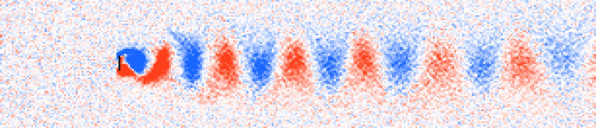
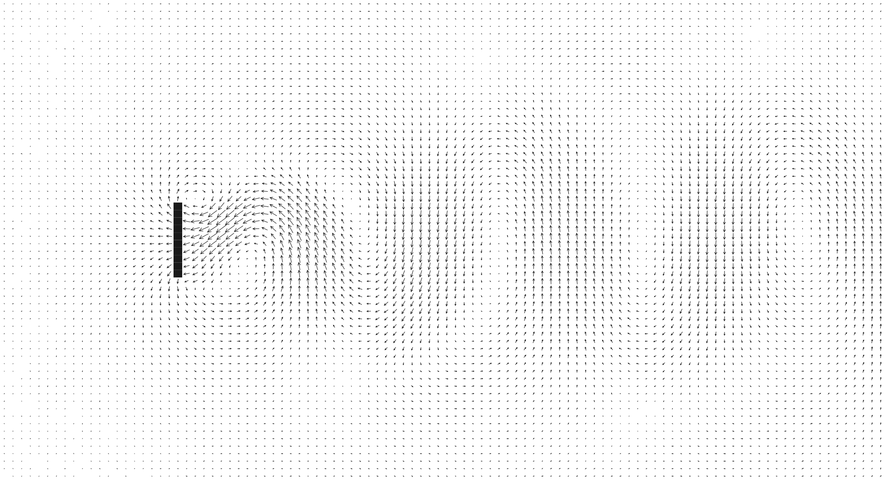

# A cellular-automaton fluid

A Rust implementation of the lattice-gas model used for the fluid-flow images
in Wolfram's *A New Kind of Science*, pp. 378-380.

Identical particles sit on the links of a hexagonal lattice, each moving one
site per step in one of six directions. When particles meet, they are
rearranged by a rule that conserves the number of particles and their total
momentum. Nothing in the rule refers to pressure, viscosity or velocity. Yet
averaged over blocks of cells the gas behaves like a continuum fluid, and past
an obstacle it separates, forms a recirculating wake, and then sheds a von
Karman vortex street.



*Vorticity after 40,000 steps of the default run: a 6144 x 1536 lattice at a
Reynolds number near 100, long enough downstream to hold a dozen vortices. Blue
and red are the two senses of rotation; the black bar is the plate.*

## Build and run

```bash
cargo build --release
```

```bash
./target/release/lgca
```

The defaults are chosen to reproduce the book's picture on a laptop: 6144 x
1536 cells, a plate 173 cells across, Reynolds number near 100. That is 9.4
million cells in about 30 MB, and some nine seconds on an M3 Pro. The lattice
is far wider than it is tall because a vortex street is: the wake needs room to
shed a dozen vortices before it runs off the end. On a machine with no GPU the
same run is minutes rather than seconds, and `--width 2048 --steps 20000` is
the thing to reach for.

On macOS the update runs on the GPU by default, as bitplanes -- one bit per
cell per direction, 32 cells to a word, so a collision is Boolean algebra
evaluated on 32 cells at once. `--no-gpu` runs the byte-per-cell CPU kernel
instead, which is the reference implementation and about forty times slower.
The header line says which one is running. Frames are encoded on their own
threads, so writing them does not hold the simulation up.

Each frame is written twice: `vorticity-NNNN.png`, a colour map of the
vorticity (blue and red for the two senses of rotation), and
`arrows-NNNN.svg`, a velocity-arrow plot in the style of the book's figure,
with the mean flow subtracted so the fluid is at rest and the obstacle moves.



*A shorter 2048 x 1280 run as an arrow plot. With the mean flow subtracted the
plate is the thing that is moving, which is how the book presents it.*

`--alpha` defaults to `--sample-every / 25`, which holds the running time
average over a fixed 25 steps however often the field is sampled. That matters
on a big lattice, where sampling is 10% of a step: raising `--sample-every`
without it would quietly lengthen the average and smear the vortices as they
advect, rather than saving anything. What a longer interval does cost is noise,
since the average then holds fewer samples --- roughly `(1/alpha) * block^2`
cells --- so it wants a bigger `--block` to pay for itself.

`--help` lists every option. To turn the frames into a movie, if you have
ffmpeg:

```bash
ffmpeg -framerate 20 -i out/vorticity-%04d.png -pix_fmt yuv420p flow.mp4
```

## What the rules are

Six directions, plus optionally a seventh stationary state, give 64 or 128
possible cell states packed into one byte. The collision rule is generated
rather than hand-written: states are grouped by particle count and total
momentum, and a collision replaces a state with one drawn uniformly from its
own group. This conserves both invariants exactly, is symmetric (so
semi-detailed balance holds and the equilibrium is the expected Fermi-Dirac
distribution), and fires on every configuration that has an alternative --
which is what keeps the viscosity low.

The stationary state is the FHP-III model and is on by default. It roughly
halves the viscosity and so roughly doubles the Reynolds number reachable on a
given lattice. `--no-rest` gives the six-direction rule the book uses.

Obstacles are handled by bounce-back: particles that stream into a solid site
have their directions reversed and leave the way they came. The left edge is
re-seeded each step from an equilibrium distribution at the requested density
and speed, which is what maintains the flow; particles that leave the right
edge wrap around into that zone and are overwritten, making the outflow
effectively absorbing.

## Transport coefficients

A lattice gas is only a fluid after averaging, and the viscosity and advection
coefficient it ends up with are properties of the rules, not free parameters.
The program measures both instead of quoting them:

```bash
./target/release/lgca --measure
```

This runs on whichever backend the simulation will, so the coefficients
reported are the ones the running code actually has. The two agree: `nu` 0.2989
on the CPU against 0.3080 on the GPU, `g` 0.4405 against 0.4361, both inside
the spread of the estimator across seeds.

* **Viscosity** comes from a shear wave seeded in a periodic box, whose
  amplitude decays as `exp(-nu k^2 t)`.
* **Advection factor `g`** comes from a transverse wave riding on a uniform
  stream. The pattern is advected at `g U`, not at `U`, so the drift of its
  phase measures `g` directly. A real fluid has `g = 1`; a lattice gas does
  not, because its equilibrium is not Galilean invariant.

Both are read off a single Fourier mode, averaged over several independent
realisations before fitting so that the lattice's own noise cancels rather than
biasing the fit. The Reynolds number is then `g U L / nu`.

`--scan-density` sweeps this across densities. The measured `g` follows the
FHP expression -- `(1/2)(1-2d)/(1-d)` for six directions, and `(7/12)` in
place of the `(1/2)` once rest particles dilute the momentum per unit mass --
to within about ten percent, and vanishes at half filling as it must. That is
a useful check on the lattice and the collision table together, since `g`
depends on the equilibrium distribution rather than on the choice of
collisions. `g` repeats to better than two percent between seeds; `nu` is the
noisier of the two, at roughly ten percent. Measurements below about 0.8
particles per cell should not be trusted, as there are too few particles to
resolve the mode.

Representative values with rest particles, alongside the FHP prediction
`g = (7/12)(1-2d)/(1-d)`:

| particles/cell | nu | g measured | g predicted | g/nu |
|---|---|---|---|---|
| 0.91 | 0.44 | 0.515 | 0.496 | 1.17 |
| 1.12 | 0.41 | 0.492 | 0.472 | 1.21 |
| 1.33 | 0.36 | 0.474 | 0.447 | 1.31 |
| 1.54 | 0.31 | 0.450 | 0.419 | 1.47 |
| 1.75 | 0.28 | 0.419 | 0.389 | 1.51 |
| 2.17 | 0.24 | 0.359 | 0.321 | 1.50 |
| 2.80 | 0.20 | 0.225 | 0.194 | 1.12 |

The Reynolds coefficient is flattest between about 1.5 and 1.8 particles per
cell, which is where the defaults sit.

## Reproducing the book's figure

The book's parameters are six directions, no rest particles, one particle per
cell, and an inflow at 0.4 of the maximum speed. Measured, that combination
gives `nu = 0.91` and `g = 0.41`, hence `Re = 0.45 * U * L` -- so a Reynolds
number of 100 needs an obstacle roughly 560 cells across, and a lattice of tens
of millions of cells. That is exactly the 30 million cells the book reports
using, which is a satisfying way to arrive at someone else's parameter choice
from the other end.

```bash
./target/release/lgca --no-rest --density 0.1667 --width 8192 --height 4096 \
    --size 560 --obstacle-x 1600 --warmup 40000 --steps 150000 \
    --frame-every 2000 --out out-nks
```

Expect this to take a while. The default settings reach the same Reynolds
number on about a sixth as many cells.

## Checks

`cargo test` covers the parts that fail quietly rather than loudly:

* Mass and momentum are conserved exactly -- as integers, not to within a
  tolerance -- both by every entry of the collision table and by 200 steps of
  a randomly filled periodic box.
* A lone particle, which has no collision partner, flies in a straight line in
  all six directions from rows of both parities. This is what pins down the
  neighbour offsets of the staggered lattice.
* A particle fired at a wall comes back the way it came.
* The equilibrium sampler delivers the velocity it is asked for, with and
  without stationary particles.
* The PNG writer's deflate output round-trips through a matching decoder.

The GPU path is a second implementation of the same rules, so it gets its own
layer of checks. Its collision circuit is not hand-written: it is emitted at
startup from the same enumeration of momentum classes the CPU lookup table is
built from, and a test runs the shader that ships over every state and every
draw to confirm it agrees with that enumeration. Propagation, walls, the
inflow boundary and the coarse-graining are each checked against the CPU
version. Two `#[ignore]`d tests then ask the question that matters -- whether it
is the same *fluid* -- by measuring viscosity and the advection factor on both
paths through an identical protocol from identical initial cells:

```bash
cargo test --release --lib -- --ignored --nocapture
```

`tests/golden.rs` adds the checks that matter when optimising rather than when
writing: that a fixed run still produces the same lattice bit for bit, that it
produces the same answer twice running, and that mass and momentum come out
exactly equal however the rows are divided between threads. A change to the
order of the random draws trips the first of those and none of the others,
which is the signal that the stream moved but the fluid did not.

Two things fall out of the physics rather than the tests: the advection factor
matches the FHP prediction across the whole density range, as described above,
and the wake sheds at a Strouhal number of about 0.11, which is the right range
for a plate held across the flow at this Reynolds number.

## Speed

`cargo bench` runs the benchmark suite in `benches/speed.rs` and reports the
change against the numbers recorded in `benches/baseline.txt`. The cases cover
the update kernel at both cache-resident and production sizes, threaded and
not, on the CPU and on the GPU, the coarse-graining and analysis passes on
both, the PNG and SVG writers, and the startup viscosity measurement. [BENCHMARKS.md](BENCHMARKS.md) has the recorded
figures, what each case is for, and where the time in a default run actually
goes -- which is not where one would guess.

## Notes and limitations

* The bulk density settles a few percent below the inlet density, with the
  speed a few percent above it, so that the mass flux matches. This is a
  compressibility effect of the open outlet at Mach 0.57, and it is stable; the
  status line reports the realised values.
* Row count must be even, so the lattice wraps cleanly in y.
* The top and bottom edges are periodic, not walls.
* No dependencies: the PNG writer, the random number generator, the thread pool
  and the Metal binding are all in-tree. `Cargo.lock` lists one package.
* The two paths do not produce the same lattice: they draw from different
  random streams, so they agree on the fluid and not on the microstate.
